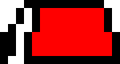

Il s'agit d'un jeu de puzzle, basé sur des chapeaux que l'on peut prendre en main et lancer, en pouvant se servir de leurs effets.

Il existe trois chapeaux différents dans le jeu :

* Le fez lorsque lancé contre une surface
* Le haut-de-forme que l'on peut utiliser comme trampoline
* Le béret qui se comporte comme une plateforme volante

Le but du jeu est de rejoindre un porte-manteau en utilisant les chapeaux. Le
porte-manteau constitue alors une porte permettant de passer au niveau suivant,
ou de finir le jeu.

Sur le build ``SDL``, le jeu utiliser les touches suivantes :

* ``q`` pour se déplacer à gauche
* ``d`` pour se déplacer à droite
* ``[SPACE]`` pour sauter
* ``e`` pour interagir
** Lorsqu'on porte un chapeau, cela permet de le lancer
** Lorsqu'on est à proximité d'un chapeau, cela permet de le porter

=== Le fez

Le fez explose les blocs à une distance maximale de 
``
include::../src/core/cst.ml[tag=fez_explode_radius]
``
pixels autour de lui lorsque projeté contre une surface à une vitesse 
de norme minimale
``
include::../src/core/cst.ml[tag=fez_explode_velocity]
``, qui est grossièrement la vitesse de lancer par défaut.

=== Le béret

C'est la seule entité (en dehors des blocs) immune à la gravité et
aux frottements du sol. Ainsi, une fois lancé (ou poussé), il devient une
plateforme mouvante permettant de traverser des puits.

=== Le haut de forme

Le haut de forme se comporte comme un trampoline : sauter dessus augmente la
vitesse du saut de
``
include::../src/core/cst.ml[tag=player_jump_speed]
`` pixels/seconde à
``
include::../src/core/cst.ml[tag=hdf_jump_speed]
`` pixels/seconde et permet d'accéder à des zones inaccessibles.lateforme permettant de traverser des puits.

=== Le porte-chapeau

Il s'agit de l'objectif du jeu ! A l'aide des chapeaux, il faut rejoindre cet
objet présent sur la carte et appuyer sur la touche ``e`` à proximité
du porte-chapeau afin de passer au niveau suivant.
